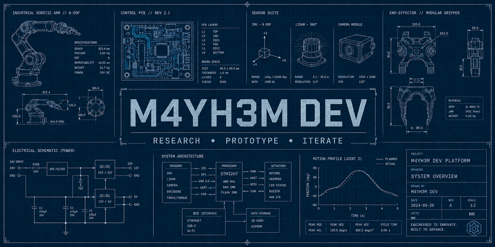
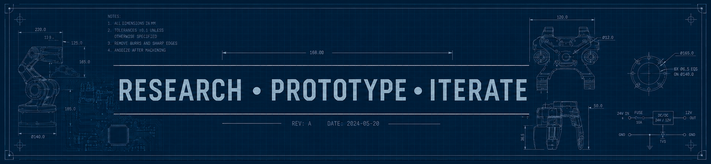

<!-- ──────────────────────────────────────────────── -->
<!--          M4YH3M | Deep-Tech Innovator README     -->
<!-- ──────────────────────────────────────────────── -->



<h1 align="center">M4YH3M — Research • Prototype • Iterate</h1>
<h3 align="center">🤖 Robotics | Embedded Systems | Hardware | Product Development</h3>

<p align="center">
  <a href="https://github.com/M4YH3M-DEV"></a>
  <a href="#"></a>
</p>

---

## *About*

> I build systems that combine hardware, software, and design into working prototypes.
> This GitHub serves as a project lab where I document experiments, development logs, prototypes, and engineering projects from embedded systems and robotics to accessibility-focused technology.

## *Current Projects*

### 🚧 [RIO](https://github.com/M4YH3M-DEV/RIO)

```text
██████░░░░░░░░░░░░░░ 30%
STATUS: ACTIVE DEVELOPMENT

Building practical, scalable systems through rapid prototyping, engineering, and real-world testing.
```


### ✅ [SONO AI](https://github.com/M4YH3M-DEV/SONO-AI)

```text
████████████████████ 100%
STATUS: COMPLETED

Accessibility platform designed to improve communication for deaf users through real-time interaction technologies.
```

## *Project Archive*

| ID | Project | Domain | Description | Status |
|:-----|:-----------|:---------|:---------------|:-----------|
| 001 | **[PROJECT NAME](repo-link)** | nananannana | Conscious empathy interface linking emotion, voice & visual context. | ✅ |
| 002 | **[SONO AI](repo-link)** |  Accessibility | Real-time Speech ↔ Sign communication bridge for accessibility. | ✅ |
| 003 | **[PHOENIX DECK](repo-link)** | Embedded Systems | Portable cyberdeck for on-field programming, RF, IoT, and robotics testing. | ✅ |


> COMPLETED PROJECTS : 3

> LAST UPDATED       : 2025


## *Technical Inventory*

<div align="center">

```text
╔══════════════════════════════════════════════════════════════╗
║                 M4YH3M LABS : INVENTORY                      ║
╠══════════════════════════════════════════════════════════════╣
║                                                              ║
║   [ SYSTEMS ]                    [ HARDWARE ]                ║
║   ───────────                    ───────────                 ║
║   • Embedded Systems             • ESP32                     ║
║   • Robotics                     • Raspberry Pi              ║
║   • Human-Machine HMI            • NVIDIA Jetson             ║
║   • Accessibility Tech           • LiDAR & Sensors           ║
║                                                              ║
║   [ DESIGN ]                     [ INFRASTRUCTURE ]          ║
║   ────────                       ────────────────            ║
║   • Fusion 360                   • Linux                     ║
║   • Blender                      • Docker                    ║
║   • KiCad                        • Networking                ║
║   • EasyEDA                      • Automation                ║
║                                                              ║
╚══════════════════════════════════════════════════════════════╝
```
</div>

##  *GitHub Stats*

<div align="center">
  <table>
    <tr>
      <td width="50%" align="center">
        
        <br><br>
        
      </td>
      <td width="50%" align="center">
        
      </td>
    </tr>
  </table>
</div>


##  *Connect*
<p align="center">
  <a href="https://github.com/M4YH3M-DEV"></a>
  <a href="https://www.linkedin.com/in/hitenbalara"></a>
  <a href="mailto:hb.singh.choudhary@gmail.com"></a>
</p>


<h3 align="center"> “Research. Prototype. Iterate”</h3>


